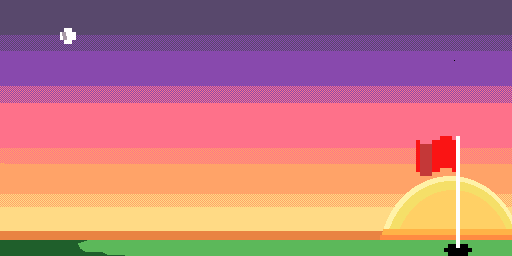

## Hi I'm Kavith Ranchagoda - thanks for swinging by!

  

  <b>Aspiring Software Engineer • Golfer • Hobbie Collector</b> 
  Turning gap in markets I'm passionate about into software solutions

  

---

### :date: What I'm upto right now 
* Finishing up my Software Engineering degree at McMaster University
* Building RanchEdge - A transparent sports data analytics platform using historical stats to reveal favorable outcomes in the sporting world
* Tightening up my golf game for the 2026 season
* Experimenting with new flavours in the kitchen from East & South Asia

---

### :potted_plant: What I'm currently learning
* Swift and SwiftUI for IOS Development
* Computer Vision, Skeleton Tracking and Pose Estimation for a private Golf related app

---

<h3 align="center">📫 Connect with me</h3>

  
  &nbsp;&nbsp;&nbsp;
    
  &nbsp;&nbsp;&nbsp;
  

